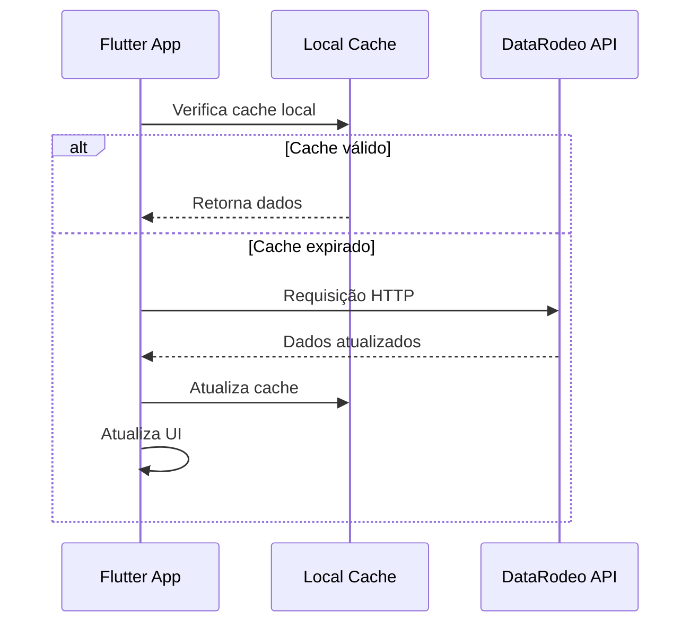

# 🏗️ Arquitetura Atual do Sistema Comentarista

## 📋 Visão Geral da Arquitetura

O Sistema Comentarista atualmente utiliza uma **arquitetura híbrida** que combina:
- **Frontend Flutter** (aplicação móvel)
- **API Externa DataRodeo** (backend de terceiros)
- **Cache Local** (dados temporários e fallback)

## 🔄 Arquitetura Atual

### **Diagrama da Arquitetura**
```
┌─────────────────────────────────────────────────────────────┐
│                    FRONTEND FLUTTER                        │
│  ┌─────────────────────────────────────────────────────┐   │
│  │                 UI LAYER                            │   │
│  │  ┌─────────────┐ ┌─────────────┐ ┌─────────────┐   │   │
│  │  │   Screens   │ │   Widgets   │ │  Providers  │   │   │
│  │  └─────────────┘ └─────────────┘ └─────────────┘   │   │
│  └─────────────────────────────────────────────────────┘   │
├─────────────────────────────────────────────────────────────┤
│                  BUSINESS LOGIC LAYER                      │
│  ┌─────────────────────────────────────────────────────┐   │
│  │  ┌─────────────┐ ┌─────────────┐ ┌─────────────┐  │   │
│  │  │EventService │ │AuthService  │ │DataRodeoSvc │  │   │
│  │  └─────────────┘ └─────────────┘ └─────────────┘  │   │
│  └─────────────────────────────────────────────────────┘   │
├─────────────────────────────────────────────────────────────┤
│                    DATA LAYER                             │
│  ┌─────────────────────────────────────────────────────┐   │
│  │  ┌─────────────┐ ┌─────────────┐ ┌─────────────┐  │   │
│  │  │ApiService   │ │Local Cache  │ │JSON Fallback│  │   │
│  │  └─────────────┘ └─────────────┘ └─────────────┘  │   │
│  └─────────────────────────────────────────────────────┘   │
└─────────────────────────────────────────────────────────────┘
                                │
                                ▼
                    ┌─────────────────────────┐
                    │    API EXTERNA          │
                    │   DATA RODEO            │
                    │  (datarodeo.com.br)     │
                    └─────────────────────────┘
```

### **Componentes Principais**

#### **1. Frontend (Flutter)**
- **Framework**: Flutter 3.0+ com Dart
- **Arquitetura**: Clean Architecture com Provider
- **Navegação**: Navigator 2.0 + Bottom Navigation
- **UI**: Material Design 3 com tema escuro

#### **2. Camada de Negócio**
- **EventService**: Lógica de eventos e rodadas
- **AuthService**: Autenticação e sessão
- **DataRodeoService**: Integração com API externa

#### **3. Camada de Dados**
- **ApiService**: Cliente HTTP centralizado
- **Cache Local**: SharedPreferences + memória
- **Fallback**: Dados JSON locais

#### **4. API Externa**
- **Serviço**: DataRodeo API
- **URL**: `https://datarodeo.com.br/api`
- **Formato**: REST JSON
- **Autenticação**: JWT

## 🔌 Integração com API Externa

### **Fluxo de Dados Atual**


### **Endpoints Utilizados**
```yaml
Eventos:
  - GET /events - Lista eventos
  - GET /events/{id} - Detalhes do evento
  - GET /events/{id}/stages - Etapas disponíveis

Rodadas:
  - GET /events/{id}/rounds - Rodadas do evento
  - GET /rounds/{id} - Detalhes da rodada

Rankings:
  - GET /events/{id}/rankings - Ranking completo
  - GET /events/{id}/stats - Estatísticas

Participantes:
  - GET /animals - Lista de animais
  - GET /competitors - Lista de competidores
  - GET /tropeiros - Lista de tropeiros
```

### **Estratégia de Fallback**
```dart
class EventService {
  static Future<Map<String, dynamic>> loadEventData() async {
    try {
      // 1. Tenta carregar da API DataRodeo
      if (_currentEventId != null) {
        final apiData = await loadFromDataRodeoAPI();
        if (apiData.isNotEmpty) return apiData;
      }
      
      // 2. Fallback para JSON local
      final localData = await loadFromLocalJSON();
      return localData;
      
    } catch (e) {
      // 3. Fallback para dados padrão
      return getDefaultData();
    }
  }
}
```

## 📊 Vantagens da Arquitetura Atual

### **✅ Pontos Positivos**
- **Rápida implementação** - API externa já disponível
- **Dados reais** - Informações em tempo real
- **Baixo custo** - Sem necessidade de infraestrutura própria
- **Manutenção reduzida** - Backend gerenciado por terceiros
- **Escalabilidade** - API externa já escalável

### **❌ Limitações Atuais**
- **Dependência externa** - Sem controle sobre disponibilidade
- **Funcionalidades limitadas** - Restrito ao que a API oferece
- **Customização limitada** - Não pode adaptar para necessidades específicas
- **Latência** - Dependência de rede externa
- **Custos variáveis** - Preços podem mudar

## 🚀 Plano de Separação Backend/Frontend

### **Objetivo**
Transformar a arquitetura atual em uma **solução própria** mantendo a funcionalidade existente e adicionando recursos customizados.

### **Estratégia de Migração**

#### **FASE 1: Preparação e Limpeza** (Atual)
- [x] **Refatoração do código** - Limpeza e organização
- [x] **Padronização de APIs** - Interface consistente
- [x] **Melhoria do cache** - Estratégias de cache inteligente
- [x] **Tratamento de erros** - Sistema robusto de fallback

#### **FASE 2: Desenvolvimento Paralelo** (Próxima)
- [ ] **Criação do backend próprio** - Desenvolvimento em paralelo
- [ ] **API compatível** - Endpoints idênticos aos atuais
- [ ] **Banco de dados próprio** - PostgreSQL/MySQL
- [ ] **Autenticação própria** - Sistema JWT próprio

#### **FASE 3: Migração Gradual** (Futura)
- [ ] **Deploy do backend próprio** - Ambiente de produção
- [ ] **Migração de endpoints** - Um por vez
- [ ] **Testes de compatibilidade** - Validação funcional
- [ ] **Fallback inteligente** - API própria + externa

#### **FASE 4: Consolidação** (Final)
- [ ] **Remoção da dependência externa** - API própria única
- [ ] **Funcionalidades avançadas** - Recursos customizados
- [ ] **Otimizações específicas** - Performance para casos de uso
- [ ] **Escalabilidade própria** - Controle total da infraestrutura

### **Arquitetura Futura Proposta**

```
┌─────────────────────────────────────────────────────────────┐
│                    FRONTEND FLUTTER                        │
│  ┌─────────────────────────────────────────────────────┐   │
│  │                 UI LAYER                            │   │
│  │  ┌─────────────┐ ┌─────────────┐ ┌─────────────┐   │   │
│  │  │   Screens   │ │   Widgets   │ │  Providers  │   │   │
│  │  └─────────────┘ └─────────────┘ └─────────────┘   │   │
│  └─────────────────────────────────────────────────────┘   │
├─────────────────────────────────────────────────────────────┤
│                  BUSINESS LOGIC LAYER                      │
│  ┌─────────────────────────────────────────────────────┐   │
│  │  ┌─────────────┐ ┌─────────────┐ ┌─────────────┐  │   │
│  │  │EventService │ │AuthService  │ │CustomSvc    │  │   │
│  │  └─────────────┘ └─────────────┘ └─────────────┘  │   │
│  └─────────────────────────────────────────────────────┘   │
├─────────────────────────────────────────────────────────────┤
│                    DATA LAYER                             │
│  ┌─────────────────────────────────────────────────────┐   │
│  │  ┌─────────────┐ ┌─────────────┐ ┌─────────────┐  │   │
│  │  │ApiService   │ │Local Cache  │ │Database     │  │   │
│  │  └─────────────┘ └─────────────┘ └─────────────┘  │   │
│  └─────────────────────────────────────────────────────┘   │
└─────────────────────────────────────────────────────────────┘
                                │
                                ▼
                    ┌─────────────────────────┐
                    │    BACKEND PRÓPRIO      │
                    │   (Node.js/Express)     │
                    │  + PostgreSQL/MySQL     │
                    │  + Redis (Cache)        │
                    │  + JWT Auth             │
                    └─────────────────────────┘
```

## 🛠️ Tecnologias para Backend Próprio

### **Stack Recomendada**
- **Runtime**: Node.js 18+ com TypeScript
- **Framework**: Express.js ou Fastify
- **Banco de Dados**: PostgreSQL (principal) + Redis (cache)
- **ORM**: Prisma ou TypeORM
- **Autenticação**: JWT + Refresh Tokens
- **Validação**: Joi ou Zod
- **Documentação**: Swagger/OpenAPI

### **Estrutura de Pastas Proposta**
```
backend/
├── src/
│   ├── controllers/          # Controladores da API
│   │   ├── eventController.ts
│   │   ├── roundController.ts
│   │   ├── rankingController.ts
│   │   └── authController.ts
│   ├── services/             # Lógica de negócio
│   │   ├── eventService.ts
│   │   ├── roundService.ts
│   │   └── rankingService.ts
│   ├── models/               # Modelos do banco
│   │   ├── Event.ts
│   │   ├── Round.ts
│   │   └── User.ts
│   ├── routes/               # Rotas da API
│   │   ├── eventRoutes.ts
│   │   ├── roundRoutes.ts
│   │   └── authRoutes.ts
│   ├── middleware/            # Middlewares
│   │   ├── auth.ts
│   │   ├── validation.ts
│   │   └── errorHandler.ts
│   └── utils/                # Utilitários
│       ├── database.ts
│       ├── logger.ts
│       └── helpers.ts
├── database/
│   ├── migrations/           # Migrações do banco
│   ├── seeds/                # Dados iniciais
│   └── schema/               # Esquemas
├── tests/                    # Testes automatizados
├── docs/                     # Documentação da API
└── docker/                   # Configuração Docker
```

## 📈 Benefícios da Separação

### **🎯 Controle Total**
- **Funcionalidades customizadas** - Recursos específicos para rodeios
- **Performance otimizada** - Cache e otimizações específicas
- **Escalabilidade controlada** - Infraestrutura sob controle
- **Segurança aprimorada** - Controle total de autenticação

### **💰 Economia a Longo Prazo**
- **Sem custos variáveis** - Preços fixos de infraestrutura
- **Otimização de recursos** - Uso eficiente de servidores
- **Redução de dependências** - Menos serviços externos
- **Valor agregado** - Produto mais competitivo

### **🚀 Inovação e Crescimento**
- **Novas funcionalidades** - Recursos exclusivos
- **Integrações avançadas** - APIs para terceiros
- **Analytics próprio** - Dados de uso e performance
- **Expansão de mercado** - Produto para outros setores

## 🔄 Cronograma de Implementação

### **Mês 1-2: Preparação**
- [ ] Análise detalhada dos requisitos
- [ ] Design da arquitetura do backend
- [ ] Configuração do ambiente de desenvolvimento
- [ ] Criação dos modelos de dados

### **Mês 3-4: Desenvolvimento Core**
- [ ] Implementação dos endpoints básicos
- [ ] Sistema de autenticação
- [ ] Banco de dados e migrações
- [ ] Testes unitários

### **Mês 5-6: Integração e Testes**
- [ ] Integração com frontend Flutter
- [ ] Testes de integração
- [ ] Testes de performance
- [ ] Documentação da API

### **Mês 7-8: Deploy e Migração**
- [ ] Deploy em ambiente de produção
- [ ] Migração gradual dos endpoints
- [ ] Monitoramento e ajustes
- [ ] Treinamento da equipe

## 📊 Métricas de Sucesso

### **Técnicas**
- **Performance**: Tempo de resposta < 200ms
- **Disponibilidade**: Uptime > 99.9%
- **Escalabilidade**: Suporte a 10k+ usuários simultâneos
- **Segurança**: Zero vulnerabilidades críticas

### **Negócio**
- **Redução de custos**: -30% em custos de API
- **Satisfação do usuário**: +25% em NPS
- **Funcionalidades**: +50% de recursos disponíveis
- **Tempo de desenvolvimento**: -40% para novas features

## 🚨 Riscos e Mitigações

### **Riscos Identificados**
1. **Complexidade técnica** - Backend próprio mais complexo
2. **Tempo de desenvolvimento** - Projeto pode atrasar
3. **Manutenção** - Necessidade de equipe dedicada
4. **Migração de dados** - Possível perda de dados

### **Estratégias de Mitigação**
1. **Desenvolvimento incremental** - Funcionalidades por fases
2. **Testes extensivos** - Validação em cada etapa
3. **Documentação detalhada** - Conhecimento preservado
4. **Backup e rollback** - Plano de contingência

## 🤝 Próximos Passos

### **Imediatos (Esta Semana)**
- [ ] Revisão e aprovação do plano
- [ ] Definição da equipe de desenvolvimento
- [ ] Configuração do ambiente de desenvolvimento
- [ ] Criação do repositório do backend

### **Curto Prazo (Próximo Mês)**
- [ ] Design detalhado da arquitetura
- [ ] Criação dos modelos de dados
- [ ] Implementação dos endpoints básicos
- [ ] Testes de conceito

### **Médio Prazo (3-6 meses)**
- [ ] Desenvolvimento completo do backend
- [ ] Integração com frontend
- [ ] Testes e validação
- [ ] Deploy em produção

---

**🏗️ Arquitetura Atual e Plano de Separação**  
**📱 Versão**: 1.0.0  
**🔄 Última atualização**: Janeiro 2025  
**🎯 Status**: Fase 1 - Preparação e Limpeza  

*Documento técnico para planejamento da separação backend/frontend.*
