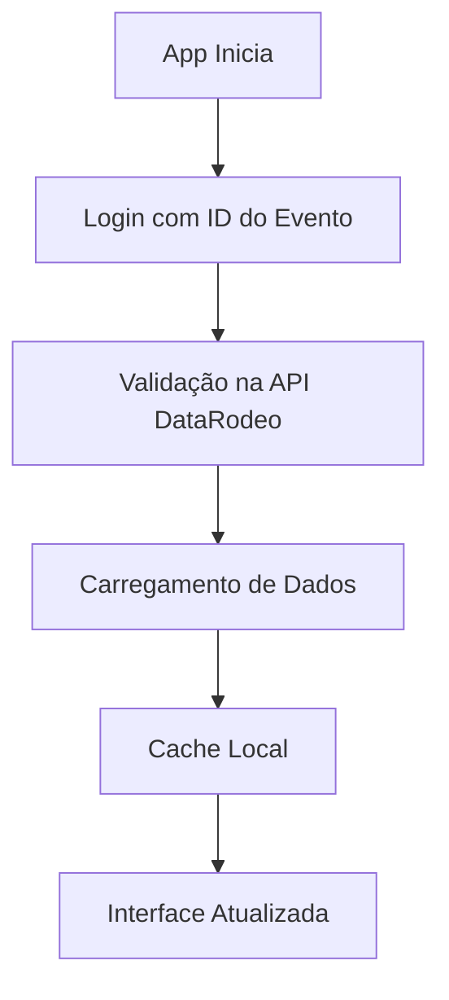
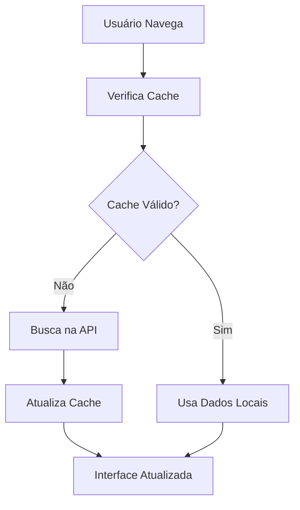
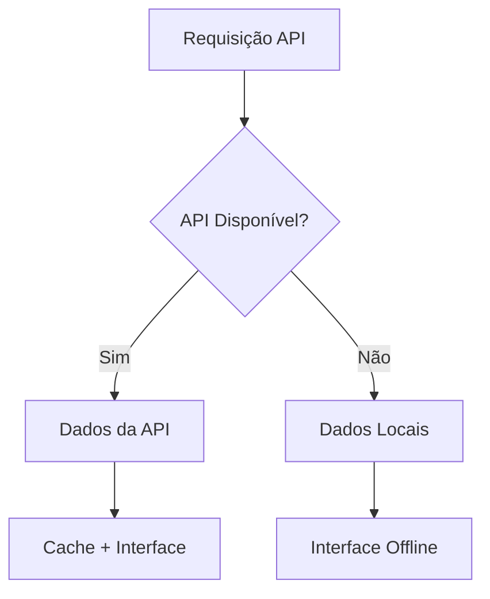

# 🌐 API do Sistema Comentarista - Integração DataRodeo

## 📋 Visão Geral
Esta documentação descreve a integração do Sistema Comentarista com a API externa **DataRodeo**, responsável por fornecer dados em tempo real de rodeios, competições e pontuações.

## 🔗 API Externa Principal

### **DataRodeo API**
- **Base URL**: `https://datarodeo.com.br/api`
- **Serviço**: API externa de terceiros
- **Responsabilidade**: Fornecimento de dados de rodeios
- **Formato**: REST API com JSON
- **Autenticação**: JWT Bearer Token

### **Endpoints Disponíveis**
```yaml
Eventos:
  - GET /events - Lista todos os eventos
  - GET /events/{id} - Detalhes de um evento específico
  - GET /events/{id}/stages - Etapas disponíveis para um evento
  - GET /events/{id}/stats - Estatísticas do evento

Rodadas:
  - GET /events/{id}/rounds - Todas as rodadas de um evento
  - GET /rounds/{id} - Detalhes de uma rodada específica

Rankings:
  - GET /events/{id}/rankings - Ranking completo do evento
  - GET /events/{id}/rankings?tipo={tipo} - Ranking por categoria

Participantes:
  - GET /animals - Lista de animais
  - GET /animals?tropeiro_id={id} - Animais por tropeiro
  - GET /competitors - Lista de competidores
  - GET /competitors?cidade={cidade}&uf={uf} - Competidores por localização
  - GET /tropeiros - Lista de tropeiros
  - GET /tropeiros?cidade={cidade}&uf={uf} - Tropeiros por localização

Juízes:
  - GET /judges - Lista de juízes disponíveis
  - GET /judges/{id} - Detalhes de um juiz específico
```

## 🔐 Autenticação e Segurança

### **JWT Token Management**
```http
Authorization: Bearer <access_token>
Content-Type: application/json
Accept: application/json
```

### **Fluxo de Autenticação**
1. **Login**: Validação do ID do evento
2. **Token**: Geração de JWT pela API externa
3. **Refresh**: Renovação automática de tokens
4. **Cache**: Armazenamento local seguro

### **Configuração de Segurança**
```dart
// Headers padrão para todas as requisições
static const Map<String, String> defaultHeaders = {
  'Content-Type': 'application/json',
  'Accept': 'application/json',
  'User-Agent': 'Comentarista/1.0.0',
  'Accept-Language': 'pt-BR,pt;q=0.9,en;q=0.8',
};
```

## 📊 Estrutura de Dados

### **Modelo de Evento**
```json
{
  "id": 86,
  "nome": "ENGENHO RODEO FEST",
  "data_inicio": "2025-08-22",
  "data_fim": "2025-08-22",
  "status": "ativo",
  "tipo": "rodeio",
  "local": "São Paulo, SP"
}
```

### **Modelo de Rodada**
```json
{
  "id": 3328,
  "event_id": 86,
  "animal": "ANDROID",
  "animal_descricao": "Touro de montaria",
  "competidor": "ALEF DE CAMPOS LIMA",
  "competidor_descricao": "Competidor profissional",
  "etapa": "ROUND5",
  "nota_animal": 73.0,
  "nota_competidor": 73.0,
  "nota_total": 146.0,
  "tempo": 8.5,
  "lado": "C",
  "seq": 1,
  "id_animal": 123,
  "id_competidor": 456,
  "id_etapa": 5
}
```

### **Modelo de Ranking**
```json
{
  "posicao": 1,
  "competidor": "LÉO RODRIGO NARCISO DE FRANÇA",
  "cidade": "BRODOWSKI - SP",
  "nota": 249.5,
  "nota_dif": 0,
  "etapas_completadas": 4,
  "media_por_etapa": 62.375
}
```

### **Modelo de Animal**
```json
{
  "id": 123,
  "nome": "ANDROID",
  "descricao": "Touro de montaria",
  "tropeiro_id": 789,
  "tropeiro_nome": "CIA. 38",
  "cidade": "São Paulo, SP",
  "media_notas": 72.5,
  "total_rodadas": 15
}
```

### **Modelo de Competidor**
```json
{
  "id": 456,
  "nome": "ALEF DE CAMPOS LIMA",
  "cpf": "123.456.789-00",
  "data_nascimento": "1990-05-15",
  "cidade": "São Paulo, SP",
  "uf": "SP",
  "media_notas": 71.8,
  "total_rodadas": 12
}
```

### **Modelo de Tropeiro**
```json
{
  "id": 789,
  "nome": "CIA. 38",
  "cidade": "São Paulo, SP",
  "uf": "SP",
  "media_notas": 73.2,
  "total_animais": 25,
  "posicao_ranking": 3
}
```

## 🔄 Fluxo de Dados

### **1. Carregamento Inicial**


### **2. Atualização em Tempo Real**


### **3. Fallback Strategy**


## ⚡ Performance e Cache

### **Estratégias de Cache**
- **API Cache**: Dados em memória por 5 minutos
- **Token Cache**: JWT armazenado por 24 horas
- **Image Cache**: Imagens e ícones em cache local
- **State Cache**: Estado da aplicação persistido

### **Otimizações**
```dart
class CacheManager {
  static const Duration apiCacheDuration = Duration(minutes: 5);
  static const Duration tokenCacheDuration = Duration(hours: 24);
  static const Duration imageCacheDuration = Duration(days: 7);
  
  // Cache em memória para dados frequentes
  static final Map<String, dynamic> _memoryCache = {};
  
  // Cache local para persistência
  static Future<void> saveToLocal(String key, dynamic data);
  static Future<T?> getFromLocal<T>(String key);
}
```

### **Rate Limiting**
- **Limite**: 1000 requisições por hora por usuário
- **Headers de resposta**:
  - `X-RateLimit-Limit`: Limite de requisições
  - `X-RateLimit-Remaining`: Requisições restantes
  - `X-RateLimit-Reset`: Timestamp de reset

## 🚨 Tratamento de Erros

### **Códigos de Status HTTP**
```dart
class HttpStatusCodes {
  static const int ok = 200;
  static const int created = 201;
  static const int badRequest = 400;
  static const int unauthorized = 401;
  static const int forbidden = 403;
  static const int notFound = 404;
  static const int internalServerError = 500;
  static const int rateLimitExceeded = 429;
}
```

### **Exceções Customizadas**
```dart
class ApiException implements Exception {
  final String message;
  final int? statusCode;
  
  ApiException(this.message, {this.statusCode});
}

class UnauthorizedException extends ApiException {
  UnauthorizedException(super.message) : super(statusCode: 401);
}

class RateLimitException extends ApiException {
  RateLimitException(super.message) : super(statusCode: 429);
}
```

### **Estratégias de Retry**
```dart
class RetryStrategy {
  static const int maxRetries = 3;
  static const Duration retryDelay = Duration(seconds: 2);
  
  static Future<T> withRetry<T>(
    Future<T> Function() operation,
    int maxAttempts = maxRetries,
  ) async {
    // Implementação de retry com backoff exponencial
  }
}
```

## 📱 Integração com Flutter

### **Service Layer**
```dart
class DataRodeoService {
  // Integração principal com a API externa
  static Future<List<Evento>> getEvents({int page = 1, int limit = 20});
  static Future<Evento?> getEvent(String eventId);
  static Future<List<Round>> getEventRounds(String eventId);
  static Future<List<Map<String, dynamic>>> getEventRanking(String eventId);
}
```

### **Error Handling**
```dart
class ApiErrorHandler {
  static void handleError(dynamic error, BuildContext context) {
    if (error is UnauthorizedException) {
      // Redirecionar para login
      Navigator.pushReplacementNamed(context, '/login');
    } else if (error is RateLimitException) {
      // Mostrar mensagem de rate limit
      ScaffoldMessenger.of(context).showSnackBar(
        SnackBar(content: Text('Muitas requisições. Tente novamente.')),
      );
    }
  }
}
```

### **Loading States**
```dart
class LoadingState {
  static Widget buildLoadingWidget() {
    return const Center(
      child: CircularProgressIndicator(
        valueColor: AlwaysStoppedAnimation<Color>(Colors.red),
      ),
    );
  }
}
```

## 🔮 Roadmap e Melhorias

### **Fase 1: Estabilização** ✅
- [x] Integração básica com API DataRodeo
- [x] Sistema de autenticação JWT
- [x] Cache local para performance
- [x] Tratamento de erros básico

### **Fase 2: Otimizações** 🔄
- [ ] Cache inteligente com invalidação
- [ ] Retry automático para falhas de rede
- [ ] Compressão de dados para economia de banda
- [ ] Sincronização em background

### **Fase 3: Funcionalidades Avançadas** 📋
- [ ] WebSocket para dados em tempo real
- [ ] Push notifications para atualizações
- [ ] Modo offline completo
- [ ] Sincronização multi-dispositivo

### **Fase 4: Backend Próprio** 🚀
- [ ] Desenvolvimento de backend próprio
- [ ] Migração gradual da API externa
- [ ] Funcionalidades customizadas
- [ ] Escalabilidade e performance

## 📊 Monitoramento e Analytics

### **Métricas de Performance**
```dart
class ApiMetrics {
  static void trackApiCall(String endpoint, Duration duration) {
    // Rastreamento de tempo de resposta
    // Métricas de sucesso/falha
    // Performance por endpoint
  }
  
  static void trackCacheHit(String key) {
    // Taxa de cache hit
    // Eficiência do cache
  }
}
```

### **Logs e Debugging**
```dart
class ApiLogger {
  static void logRequest(String method, String url, Map<String, dynamic>? body) {
    if (kDebugMode) {
      print('🌐 API Request: $method $url');
      if (body != null) print('📦 Body: $body');
    }
  }
  
  static void logResponse(String url, int statusCode, String body) {
    if (kDebugMode) {
      print('✅ API Response: $url [$statusCode]');
      print('📄 Body: $body');
    }
  }
}
```

## 🤝 Suporte e Contato

### **Canais de Suporte**
- **Email**: api@comentarista.com
- **Documentação**: [docs.comentarista.com](https://docs.comentarista.com)
- **Status da API**: [status.datarodeo.com.br](https://status.datarodeo.com.br)
- **Issues**: [GitHub Issues](https://github.com/comentarista/issues)

### **Equipe de Desenvolvimento**
- **API Integration**: [Nome do Dev API]
- **Mobile Dev**: [Nome do Dev Mobile]
- **Backend Dev**: [Nome do Dev Backend]
- **DevOps**: [Nome do DevOps]

---

**🌐 API Comentarista - Integração DataRodeo**  
**📱 Versão**: 1.0.0  
**🔄 Última atualização**: Janeiro 2025  
**🔗 API Externa**: DataRodeo  

*Integração robusta e eficiente com API externa para dados de rodeios em tempo real.*

